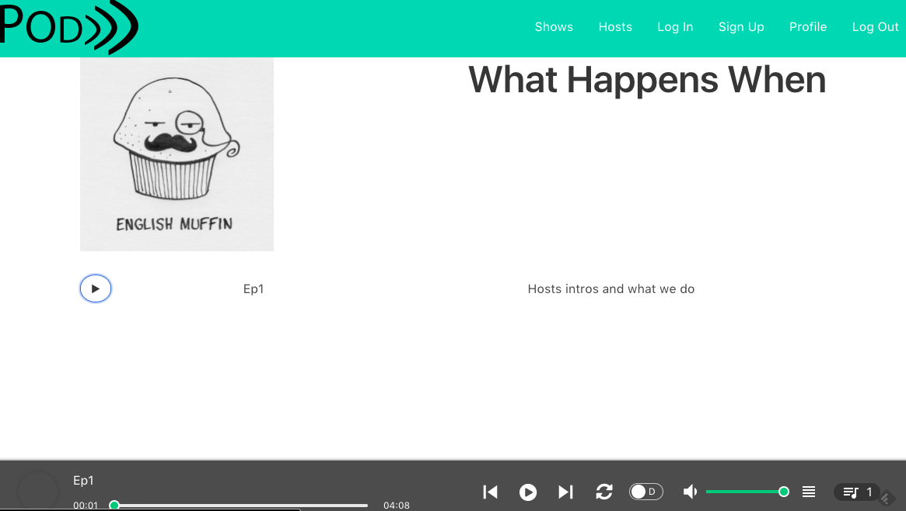
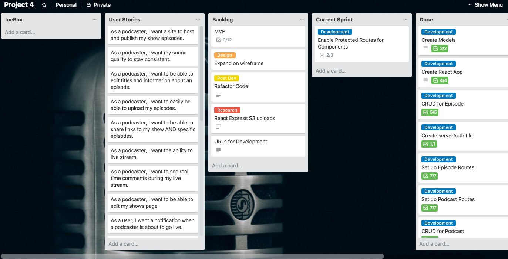

# PodFreq | A MERN Stack App

Welcome to the future of Podcast Hosting - PodFreq. A platform for Podcasters to upload their shows and episodes to share them across the world!

## Technologies Used

To create the awesome I used:

- MongoDB
- Express
- React
- Node
- Bulma

## General Approach

To make the dream come true I started by creating a Trello board.

 

I created this to use as a map to feel my way through the dark and congested path of creating a React client with a server side Node API. After creating the map, I completely disregarded it because I'm a man and where I was going I didn't need roads.

I started by creating the server API. Once that was initialized I created the necessary models and began working on implementing all CRUD actions for them. Once the API was done, I began working on the REAL magic, the React client, and making the axios calls necessary to get all the data I need for particular components. 

## Install Instructions

1. Fork the repo and clone it down
2. Run `npm install`
3. Start mongodb server and nodemon
4. `cd` into the client app
5. Run `npm install` again
6. Run `npm start`
7. Pick your jaw up from off the ground

## User Stories

For a deeper look into my user stories, check out my [Trello](https://trello.com/b/VAphJKzd/project-4)

## Time for Gratitude

🗣 to Uncle Phillippe for the help with hurdles. To the creator of the react-jinke-music-player package I used for playing audio. Dave, Cole and Andrew for th beers Thursday night. You guys are clutch.

## IT'S NOT A BUG IT'S A FEATURE!

As of the time of me writing this readme some issues are:

- No home page design
- The profile page doesn't have a link to the podcast show view
- The navbar shows same links regardless of being logged in or not

As awesome as this thing is, I still would like to:

- Have a way for users to upload files

-  Implement AWS to store uploads
- Add comments to podcast episodes
- Allow users to record podcasts live with real time comments so the audience and the host can talk shit to each other.

---

Thanks for stopping by. If you like this, check out my other [repos](https://github.com/jrrouse88) 